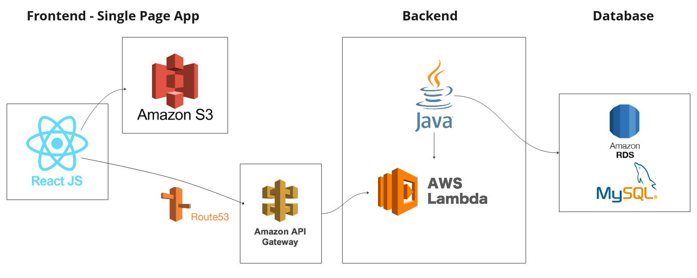
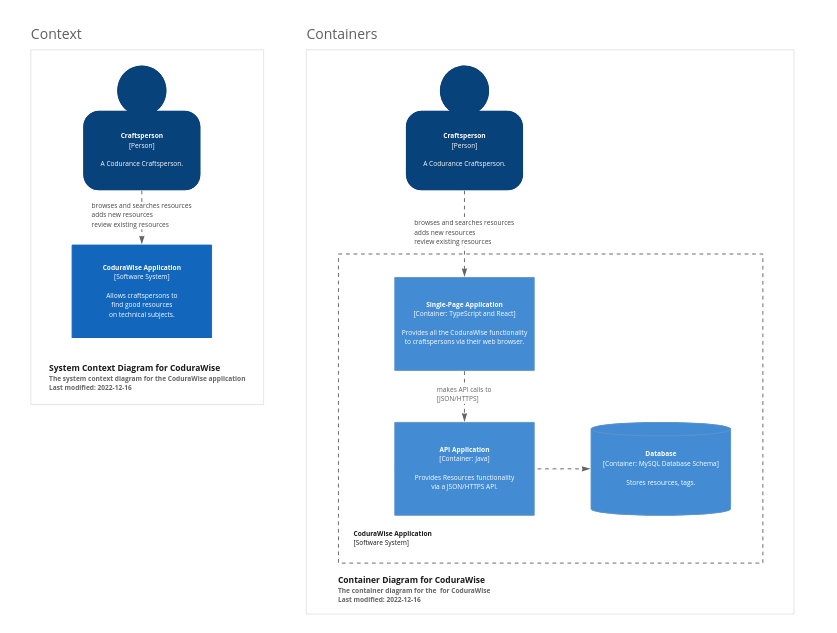
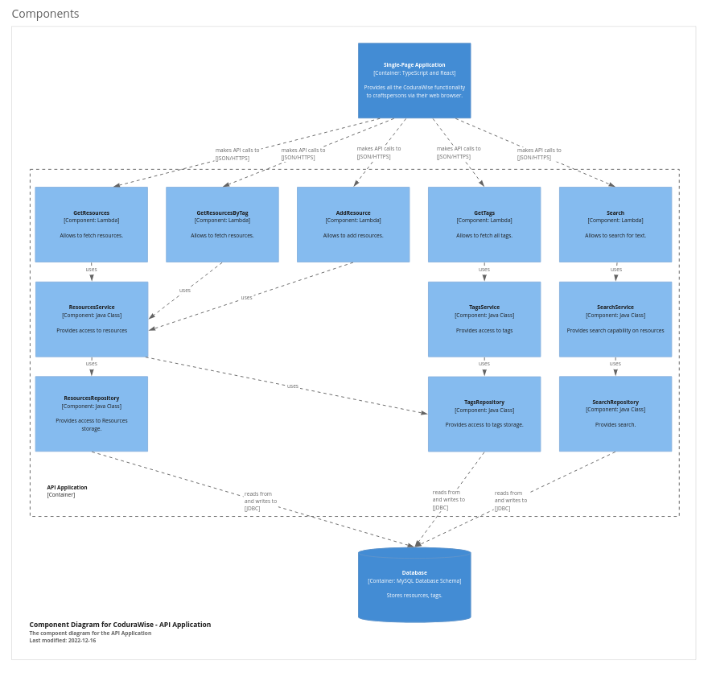

# CoduraWise - Curated Resource Sharing Platform

Crafts People want to find great resources on specific subjects, saving them time and effort sifting through poor quality and exhaustive amounts of resources.
## Features

- post resources
 - categorised by media type (video, article, book, tutorial, course)
- Customisable tags on resources
- submit ratings and reviews
- Searchable by tag and title
- Filter by media type

## Technology Stack

The app consists of a front-end and back-end using AWS services deployed with GitHub Actions.

- Front-end - React JS using TypeScript and Sass in an S3 bucket.
- Back-end - Gateways and Lambdas are used with Java using a RDS MySQL database service.
- Front and back-end pipelines using [Serverless](https://www.serverless.com)

## Overview of structure



## Manual Deployment Using [Serverless](https://www.serverless.com)

If any changes are made to the project make sure to build the application with all dependencies using:

```
gradle packageFat
```

#### Install serverless

```
npm install -g serverless
```
More information on [serverless installation](https://)

#### AWS Credentials
You will need to configure the AWS credentials. One way of doing this is with the CLI command:
```
serverless config credentials --provider aws --key <key> --secret <secret>
```

More information on the [AWS credentials configuration](https://www.serverless.com/framework/docs/providers/aws/guide/credentials/)
#### Deploy frontend

Run command inside the `infra\frontend` folder

```
npm install
serverless client deploy --no-confirm
```

#### Deploy backend

Run command inside the `infra\backend` folder

```
npm install
serverless  deploy --param="username=<db_user>" --param="password=<db_password>"
```

More information on this link:
https://www.serverless.com/plugins/serverless-finch#command-line-parameters


## Using front-end locally

#### Node JS

using:
- node version: `16.14.0`
- npm version: `8.19.3`


#### Local environment variable setup

You will need to create a `.env` file in the root of the `frontend` folder of this project. This needs to contain a variable for the base HTTP route of the back-end in the following format:
```
REACT_APP_BACKEND_URL=<back_end_base_url>
```

In the `frontend` directory, you can run:

#### To install dependences
```
npm install
```
#### Runs the app in the development mode
```
npm run start
```

Open [http://localhost:3000](http://localhost:3000) to view it in the browser.

The page will reload if you make edits.\
You will also see any lint errors in the console.

## Testing

#### Front-end

Run these commands inside the `frontend` directory.

To Launch all the test runner in the interactive watch mode:
```
npm run test
```

See the section about [running tests](https://facebook.github.io/create-react-app/docs/running-tests) for more information.

To Lanch a specific test runner:
```
npm run test [test name]
```

#### Back-end

Run this commands inside the `backend` directory.

Make sure Gradle is installed locally ([gradle installation guide](https://gradle.org/install/)) and run:
```
gradle test
```
## C4 Diagrams



